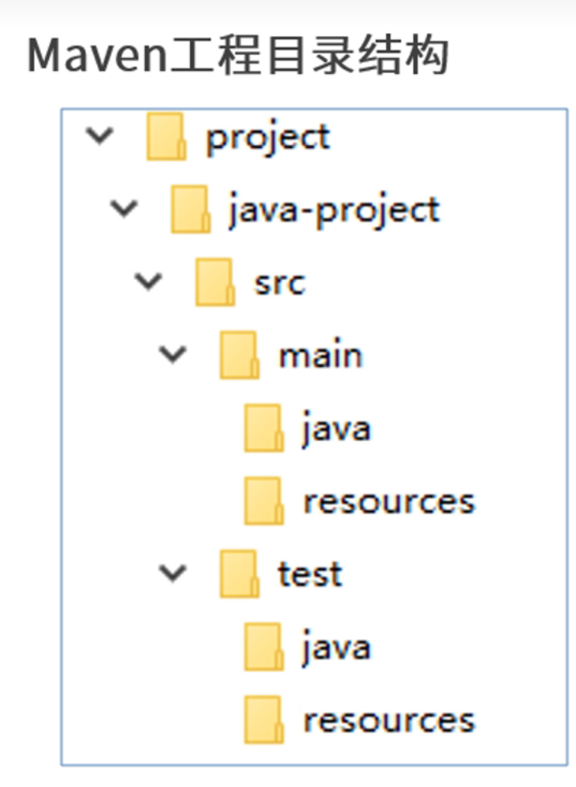
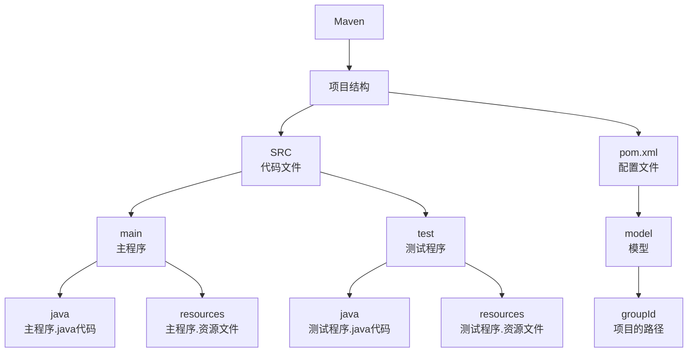

<div style="text-align: center;">
    <font size="10">Maven-Learning<br><font size="5" color="#008b8b">by shydoors</font></font>
</div>

返回基础的学习:[java](JL.md)

# Why learn?

- Maven是一个java项目的**构建**和**管理**工具，定义项目的结构，依赖和项目，并使用统一化的方式进行***自动化构建***
<br>maven的官网：[ApacheMaven](https://maven.apache.org/)
## 优势：
1. 对于.jar管理更有优势（直接用仓库进行管理，没有会从仓库里自动下载）
2. .jar间存在依赖关系的话，会自动下载有依赖关系的包（例如：jar1依赖jar2，引入了jar1,jar2也会自动引入的）

## 概念:

### 仓库
> 仓库: 用于存储资源,包含各种jar包<br>

仓库分类:
>本地仓库: 自己电脑上存储资源的仓库, 连接远程仓库获取资源
>远程仓库: 非本机电脑上的仓库, 为本地仓库提供资源
> > 中央仓库: Maven团队维护, 存储所有资源的仓库<br>
> 私服: 部门/公司范围内存储资源的仓库, 从中央仓库获取资源

1. 私服的作用:保存具有版权的资源, 包含购买或自主研发的jar
2. 中央仓库中的jar都是开源的, 不能存储具有版权的资源
3. 一定范围内共享资源, 仅对内部开放, 不对外共享

### 坐标
```xml
<groupId>
    <groupId>com.ds.stu</groupId><!--项目的路径-->
    <artifactId>cuit</artifactId> <!-- 项目ID -->
    <version>1.1-SNAPSHOT</version> <!-- 项目版本 -->
</groupId>
```
### 镜像源
```xml
<mirrors>
    <mirror>
        <id>nexus-aliyun</id><!--镜像源的id-->
        <mirrorOf>central</mirrorOf><!--表示为中央仓库-->
        <name>NexusAliyun</name><!--镜像源的名字,取什么无伤大雅-->
        <url>http://maven.aliyun.com/nexus/content/groups/public</url>
        <!--maven在下载.jar文件时会就是从这个url下载-->
    </mirror>
</mirrors>
```
## 行业标准


建议在学习过程中，使用[***Intellij IDEA***](https://www.jetbrains.com/idea/)进行开发<br>
并下载有关<font color='red'>PlantUML</font>插件，进行学习


> [!important]
> 
> pom.xml 为项目的配置文件<br>
> src 文件夹下的文件为项目的源代码文件<br>
> 且必须和pom.xml在同一级目录下


# 配置文件（示例）
```xml
<project xmlns="http://maven.apache.org/POM/4.0.0"
         xmlns:xsi="http://www.w3.org/2001/XMLSchema-instance"
         xsi:schemaLocation="http://maven.apache.org/POM/4.0.0 http://maven.apache.org/xsd/maven-4.0.0.xsd">
    <modelVersion>4.0.0</modelVersion>
    <groupId>org.apache.commons</groupId>
    <artifactId>commons-lang3</artifactId>
    <version>3.12.0</version>
    <packaging>jar</packaging>
    <name>Apache Commons Lang</name>
    <description>Provides extra functionality for classes in java.lang.</description>
    <url>https://commons.apache.org/proper/commons-lang/</url>
    <properties>
        <maven.compiler.source>1.8</maven.compiler.source>
        <maven.compiler.target>1.8</maven.compiler.target>
        <project.build.sourceEncoding>UTF-8</project.build.sourceEncoding>
    </properties>
    <dependencies>
        <dependency>
            <groupId>org.apache.commons</groupId>
            <artifactId>commons-collections4</artifactId>
            <version>4.4</version>
        </dependency>
        <dependency>
            <groupId>org.apache.commons</groupId>
            <artifactId>commons-lang3</artifactId>
            <version>3.12.0</version>
        </dependency>
    </dependencies>

    <build>
        <plugins>
            <plugin>
                <groupId>org.apache.maven.plugins</groupId>
                <artifactId>maven-compiler-plugin</artifactId>
                <version>3.8.1</version>
                <configuration>
                    <source>${maven.compiler.source}</source>
                    <target>${maven.compiler.target}</target>
                </configuration>
            </plugin>
            <plugin>
                <groupId>org.apache.maven.plugins</groupId>
                <artifactId>maven-surefire-plugin</artifactId>
                <version>2.22.2</version>
            </plugin>
        </plugins>
    </build>

    <repositories>
        <repository>
            <id>central</id>
            <url>https://repo.maven.apache.org/maven2</url>
        </repository>
    </repositories>

</project>
```

待整理：
基本信息:
groupId: 项目的组标识符，通常是组织名。
artifactId: 项目的名称。
version: 项目的版本号。
packaging: 表示项目的打包类型（如 jar）。
项目属性:
properties: 定义了一些项目属性，如 Java 编译版本和编码。
依赖:
dependencies: 列出了项目所需的依赖项。在这个示例中，包含了 commons-collections4 和 commons-lang3。
构建配置:
build: 定义了 Maven 构建过程中的插件。
maven-compiler-plugin: 用于编译 Java 代码，指定了源和目标版本。
maven-surefire-plugin: 用于运行单元测试。
仓库:
repositories: 定义了项目依赖项的 Maven 仓库地址