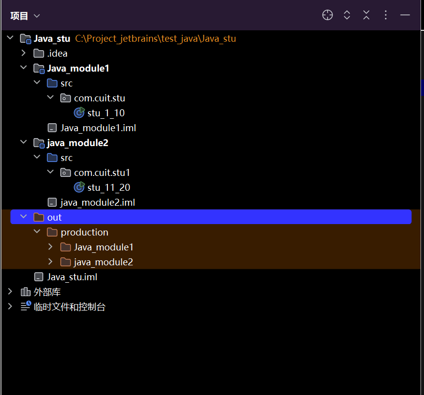
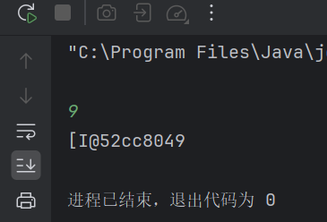
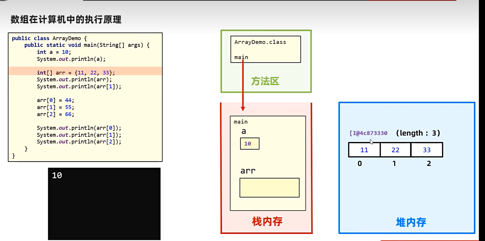
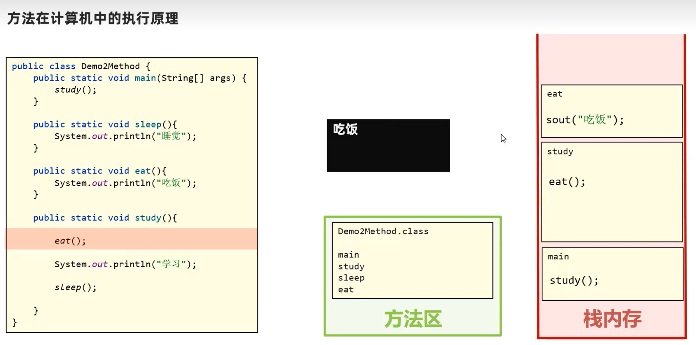
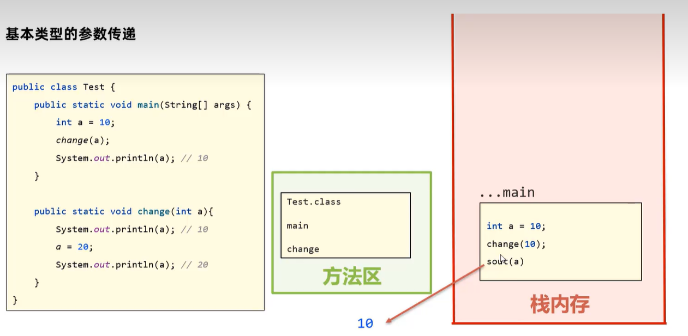
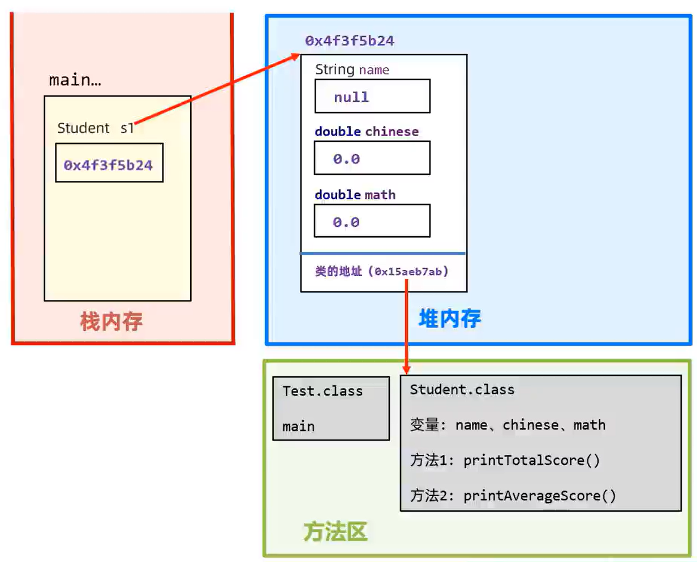
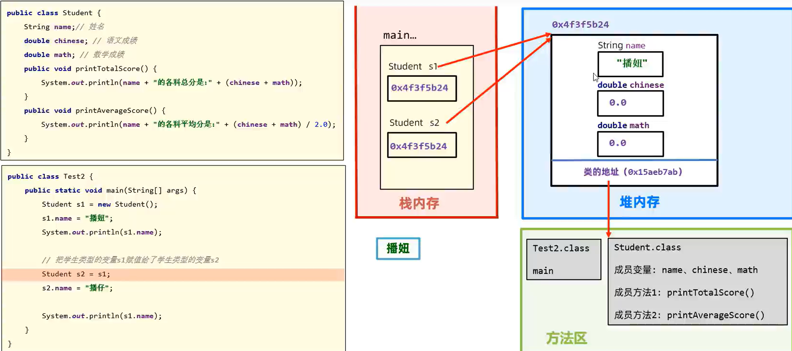
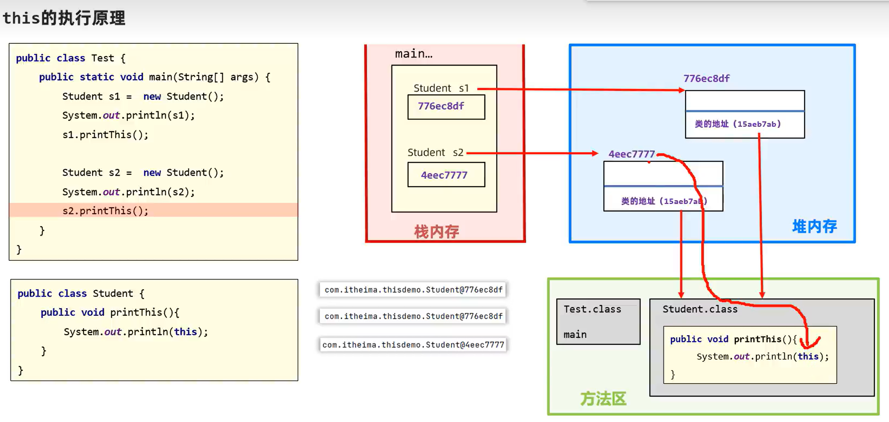

# JAVA_learn
<!-- javalearning_note by 2023051157,计科234,魏虹明-->

- 编译型语言：将code通过编译器编译成可执行文件，操作系统可运行该文件；e.g:Java的.java和.Class，C/C++的.cpp和.exe。
- 解释型语言：翻译一行代码执行一行，通过解释器运行代码。e.g.Python（事实上，Python两者都是）,JS

Java下载好JDK后（最好选择稳定版本的JDK，比如JDK8,JDK17）,可以在cmd面板中使用
## java常见cmd命令
Java 运行java的Class文件
<!--高版本JDK中，可以直接用Java命令运行java程序，但是由于CLass文件是缓存，运行后会删除，不建议这样操作-->
Javac 将Java文件（需要加后缀名）全编译成进行Class
javadoc
jar

## 项目建立

Projects(项目)->module(模块)->package(软件包)->Class(类)
Out文件：放置编译后的Class文件
反编译：将Class文件放入IDEA中，进行编译的过程。

```Java
//template
package com.cuit.stu;//软件包
public class stu_1_10 {
    public static void main(String[] args) {
        System.out.printf("Hello World");/**无自动换行*/
        System.out.println("Hello World");/**自动换行*/
        for (int i = 1; i <= 5; i++) {
            System.out.println("i = " + i);
        }
    }
}
//单行注释
/*
多行注释
*/

/** 
文档注释
*/

```
高版本IDEA中,编译运行后，项目下会自动生成out文件，并放入java生成的相应Class文件

例如这样：


## 变量

变量:用来存数据，本质上是内存中的一块区域

变量声明后才能使用，比如:

```java
int a=99;
```

|类型 |对应关键字 | 备注 |
| :----: | :-: |:--: |
| 整数   | byte/short/int/long|范围分别是： `[-2^7,2^7-1]，[-2^15,2^15-1],[-2^31,2^31-1],[-2^63,2^63-1]` |
| 浮点数  | float/double |      |
| 字符   | char | 单引号,允许各类字符，如汉字 |
| 字符串  |String |双引号|
|布尔型   | boolean|只有true和false|


### 关键字

java自带的一些字符，不允许作为变量名，函数名……不可以被重新定义，如Class,int,long,System

### 标识符

声明变量后，该变量的名字，可以由数字，字母，下划线，$……组成

例如：

```java
int a=66//int 为关键字，a为标识符
```
<font color="red">不能以数字，关键字开，区分大小写！</font>

计算机以二进制方式存数据,一个最小的数据单位叫做一个字节，详见数电_learn.md

## 运算符：


## 输入

库函数：

```Java	
package com.cuit.stu_Java_learn;//软件包
import java.util.Scanner;
public class stu_1_10 {
    public static void main(String[] args) {
        Scanner sc = new Scanner(System.in);
        long a = sc.nextLong();
        System.out.println(a);
    }
}
```

- 猜数游戏示例代码：

```java
package com.cuit.stu_Java_learn;
import java.util.Random;
import java.util.Scanner;
public class random_get {
    public static void main(String[] args) {
        Scanner sc = new Scanner(System.in);
        Random rand = new Random();
        int a=rand.nextInt(-100,100);
        while (true){
            Scanner sc1 = new Scanner(System.in);
            int x=sc1.nextInt();
            if(a==x){
                System.out.println("猜对了，就是"+a);
                break;
            }else if(x>a){
                System.out.println("猜大了");
            }else if(x<a){
                System.out.println("猜小了");
            }
        }
    }
}
```
## 数组

- 静态数组，内容，长度确定

- 动态数组，内容不确定，长度手动输入

  直接打印数组名时**会输出数组的地址**：

比如：

大写的字母I表示数组的元素时int型，@后面接实际地址

```java
package com.cuit.stu_Java_learn;//静态数组示例
import java.util.Scanner;
public class x1 {
    public static void main(String[] args) {
        int[] arr = {1,2,3,4,5,6,7,8,9,10};
        for(int i:arr){
            System.out.printf(i+" ");
        }
    }
}
```
```java
package com.cuit.stu_Java_learn;//动态数组示例
import java.util.Scanner;
public class x2 {
    public static void main(String[] args) {
        int[] arr = new int[10];
        Scanner sc=new Scanner(System.in);
        for(int i=0;i<10;++i){
            arr[i]= sc.nextInt();
        }
        for(int i:arr){
            System.out.printf(i+" ");
        }
    }
}
```
```java
package com.cuit.stu_Java_learn;//多维数组示例
import java.util.Scanner;
public class x3 {
    public static void main(String[] args) {
        Scanner sc = new Scanner(System.in);
        int col=sc.nextInt();
        int row = sc.nextInt();
        sc.nextLine();
        int[][] arr4 = new int[row][col];
        for (int i = 0; i < row; i++) {
            for (int j = 0; j < col; j++) {
                arr4[i][j] = sc.nextInt();
            }
        }
        for (int[] val1 : arr4 ) {
            for (int val : val1) {
                System.out.printf(val+" ");
            }System.out.println();
        }
    }
}
/*3行4列矩阵存入和输出 
3 4
1 5 6 8
9 15 6 11
33 55 100 101
*/
```
## Java内存分配

- 方法区：字节码文件（即：Class文件）加载的区域
- 栈：方法运行时所存入的内存，比如：main()方法
- 堆：new 函数开辟的空间，比如动态数组的空间，声明<font color="red">静态数组</font>时，其实也用了new方法，静态数组其实也存放在堆空间中

   ```java
   package com.cuit.stu_Java_learn;//静态数组示例
   public class x1 {
       public static void main(String[] args) {
           int[] arr = {1,2,3,4,5,6,7,8,9,10};
           System.out.println(arr);
           for(int i:arr){
               System.out.printf(i+" ");
           }
       }
   }
   ```

- 本地方法栈（略）
- 程序计数器（略）



## 方法

```java
package com.cuit.stu_Java_learn;
import java.util.Scanner;
public class x4 {
    public static void main(String[] args) {
        Scanner sc = new Scanner(System.in);
        int a = sc.nextInt();
        int b = sc.nextInt();
        System.out.println(sum(a,b));
    }
    public static int sum(int a, int b) {//方法的定义
        return a + b;
    }
    //private : 在同一类内可见。使用对象：变量、方法。 注意：不能修饰类（外部类）
    //public:对所有类可见。使用对象：类、接口、变量、方法
    //protected:对同一包内的类和所有子类可见。使用对象：变量、方法
    //default关键字表示默认的，能被定义它的类和同一个包中的其他类访问
    //final关键字表示最终的，不能被继承或修改
    //static关键字表示静态的方法，能被类的所有实例对象共享
    //控制访问权限的关键字，详见类的部分
}
```

### <font  color="pink">**几个注意**</font>

- 无所谓方法在类里的位置
- 方法内不可再定义一个方法，尤其是<font color="red">main</font>方法中

- void 表示无返回变量，可以不用`return`

- `return `关键字下面不用再写代码了

- `java方法`形参不支持初始值，数据传入时必须<font color="red">严格与形参</font>列表对应

  >
  > ```java
  > package com.cuit.stu_Java_learn;
  > public class x4 {
  > public static void main(String[] args) {
  >   System.out.println("Hello World");
  > }
  > public static int SUM(int a=0, int b) {//这里的 a = 0 会报错
  >   return a + b;
  > }
  > }
  > ```

- 这个特性不太好描述，直接看代码吧。

  >
  > ```java
  > package com.cuit.stu_Java_learn;
  > public class x4 {
  > public static void main(String[] args) {
  >   System.out.println("Hello World");
  >   SUM(10,11)
  >       //虽然没有将这个方法的返回变量赋给任意一个变量，
  >       //但它确确实实运行了一下，没有报错。
  >       //连警告都没有
  > }
  > public static int SUM(int a, int b) {
  >   return a + b;
  > }
  > }
  > ```
>

### 方法的运行

**栈的特点**

- 先进后出（First-In-Last-Out）,FILO原则。

先将main函数中的方法加载到方法区，然后方法区内先调用main方法，再根据main方法调用其他方法

示例：在例子中，先调用study()方法，运行，发现要调用eat()，调用eat()，<font color="red">运行</font>(方法在栈内存中运行！！！)，输出，eat()运行结束，栈中释放eat()，返回study()，发现要调用sleep()，调用运行，输出睡觉，结束运行。




### 参数

- 形参:方法声明时的变量
- 实参:方法内部定义时的变量
>```java
>public int change(int c){//这里的c为形参
>    int a=c+1;//这里的a为实参
>   return a;
>}
>```

**值传递**

#### **基本数据类型**

- 在传输实参给方法 的形参时，传的是实参变量中，存储值的副本

  > [!NOTE]
  >
  > 是副本！！！不会改变原来的实参的值！！！
  >
  > 如果要改原有的值，需要加关键字！！！

like this:



#### **引用数据类型**

由于传递数组时，传递的时地址，所以在方法内修改值时，实参也会改

like this:

```java
package com.cuit.stu_Java_learn;
public class x5 {
    public static void main(String[] args) {
        int[] a={0,1,2};
        System.out.println("实参原值a["+1+"] = "+a[0]);
        swa1(a);
        System.out.println("实参修改后，a["+1+"] = "+a[0]);
    }
    public static void swa1(int[] a){
        System.out.println("形参修改前："+a[0]);
        a[0]=99;
        System.out.println("形参修改后："+a[0]);
    }
}
```

```out
实参原值a[1] = 0
形参修改前：0
形参修改后：99
实参修改后，a[1] = 99

```

#### <font color='red'>数据的复制</font>IMPORT

引用类型的数据，用copy进行赋值，否则只是将地址赋给新的数组

```java
package com.cuit.stu_Java_learn;
public class x6 {
    public static void main(String[] args) {
        int[] a={0,1,2};
        int[] arr=copy(a);
        int[] arr2=new int[arr.length];
        copy1(arr2,a);
        for(int i:arr){
            System.out.printf(arr[i]+",");
        }System.out.println();
        for(int i:arr2){
            System.out.printf(arr2[i]+",");
        }
    }
    public static int[] copy(int[] a){
        int[] arr=new int[a.length];
        for(int i=0;i<a.length;++i){
            arr[i]=a[i];
        }return arr;
    }
    //也有其他的复制数组的方法
    public static void copy1(int[] arr,int[] a){
        System.arraycopy(a, 0, arr, 0, a.length);//这行代码表示，从a[0]开始数（含a[0]）的a.length个元素。
        //赋给arr数组，从arr[0]开始，即：arr[0]=a[0],arr[1]=a[1]之类的
    }//注意数组越界问题
}
```

## 类

<div style="display: flex; flex-direction: row;">
  <p style="text-align: center;">万物皆对象！！！</p>
  <p style="text-align: right;">    <br><br><br><br> --James Gosling（java之父）</p>
  
</div>
**e.g.**

```Java
package com.cuit.ForPlaying.calendar;
import java.util.Scanner;
public class Main {
    public static void main(String[] args) {
//        Scanner input = new Scanner(System.in);
//        int year=input.nextInt();
//        int month = input.nextInt();
        int year=2020, month=1;
        Calendar x = new Calendar(year,month);
        System.out.println(x.year);
    }
}
class Calendar{//日历类
    int year;//数据
    int month;//数据 属性 
    private int[] mon={0,31,28,31,30,31,30,31,31,30,31,30,31};//数据
    private int[] mons={31,59};//数据
    public Calendar(int year, int month) {
        /*方法 函数 行为*/
        this.year = year;
        this.month = month;
    }//给定初值时的初始化
    public Calendar() {
        this.year = 1800;
        this.month = 1;
    }//未输入初值时的初始化
    //这种写法叫重载
}
```

> [!CAUTION]
> 在一个.java文件中，只能有一个public类

### 地址的注意

一个实例会有两个地址，方法区中类的地址，堆内存中的对应对象的地址这个例子中，

- 对象的地址：0x4f3f5b24

- 类的地址：0x15aeb7ab

执行对象内部的行为时，先通过对象的地址找到类的地址，再通过类的地址找到行为



1. 一个代码文件内只能有一个public 修饰的类，且代码文件名必须和该类名一致

2. 对象与对象之间的属性互不影响

3. 对象与对象之间的‘ = ’运算符，传递的是地址

   

最好自己手写一个copy行为。这个图片内的代码为例：

```java
class Student{
    String name;
    double Chinese;
    double Math;
    public void printTotalScore() {
        System.out.println(name +"的各科总分是:"+(Chinese + Math));
    }
    public void printAverageScore() {
        System.out.println(name +"的各科平均分是:"+(Chinese + Math) / 2.0);
    }
    public Student(Student other) {
        this.name = other.name;
        this.Chinese = other.Chinese;
        this.Math = other.Math;
    }
}
```

### this关键字

this会优先调用内部的属性

```java
    public void printf_this() {
        System.out.println(this);
    }//this会传递对象的地址class Student{
    String name;
    double Chinese;
    double Math;
    public void printTotalScore() {
        System.out.println(name +"的各科总分是:"+(Chinese + Math));
    }
    public void printAverageScore() {
        System.out.println(name +"的各科平均分是:"+(Chinese + Math) / 2.0);
    }
    public Student(Student other) {
        this.name = other.name;
        this.Chinese = other.Chinese;
        this.Math = other.Math;
    }
    public void printf_this() {
        System.out.println(this);
    }//this会传递对象的地址
}
```




返回的是堆内存处的地址

### 构造器
```java
//example

public class x4 {
  public static void main(String[] args) {
    String name;
    double soc;
    STU y1=new STU();
    y1.name="xxx";
    y1.socs=3.14;
    //或者这样
    STU y2=new STU("yyy",6.28);
  }
}
class STU{
    String name;
    double socs;
    public STU(String name,double socs){
        this.name=name;
        this.socs=socs;
    }
}
```


### **各类关键字的效果表**：封装规范

**一个原则**：<font color='red'>合理暴露，合理隐藏</font>

| 关键字 | 效果 |
| :- | :- |
|public   |外界可以访问|
|private |只能被同一个类中的其他成员访问，不能被其他类访问，包括子类|
|protected |只能被同一个包中的类或其子类访问 |
|default|可以被同一个包中的类访问|
|final|用于修饰类、方法和变量，表示这些类、方法和变量不能被继承、重写或修改，多用于全局变量|
|static|用于修饰类的成员变量和成员方法，表示这些成员变量和成员方法属于类本身，而不是属于类的实例。将类视作一个程序，而这个关键字修饰的内容则是程序框架，不是变量，函数……|
|abstract| 用于修饰类和方法，表示这些类和方法是抽象的，不能被实例化或直接调用。 |
|interface| 用于定义接口，表示一组抽象方法的集合|
|enum| 用于定义枚举类型，表示一组固定的常量值|
|synchronized| 用于修饰方法和代码块，表示这些方法和代码块是线程安全的|
|volatile|用于修饰变量，表示这些变量的值可能会被多个线程同时访问和修改|
|transient|用于修饰变量，表示这些变量的值不应该被序列化|

### JavaBean

这是一种特殊的类

特点：

1. 成员变量(属性)全员私有（private）,但每个属性都有对应的get,set函数
2. 类中有一个公共的无参构造器
> 工程中，类的内部属性太多了，内部再定义一个JavaBean，仅仅只是为了封装那些数据需要输入输出的数据
>
> 即：数据和数据的业务处理相分离
