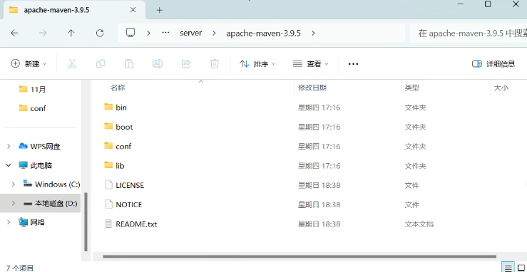
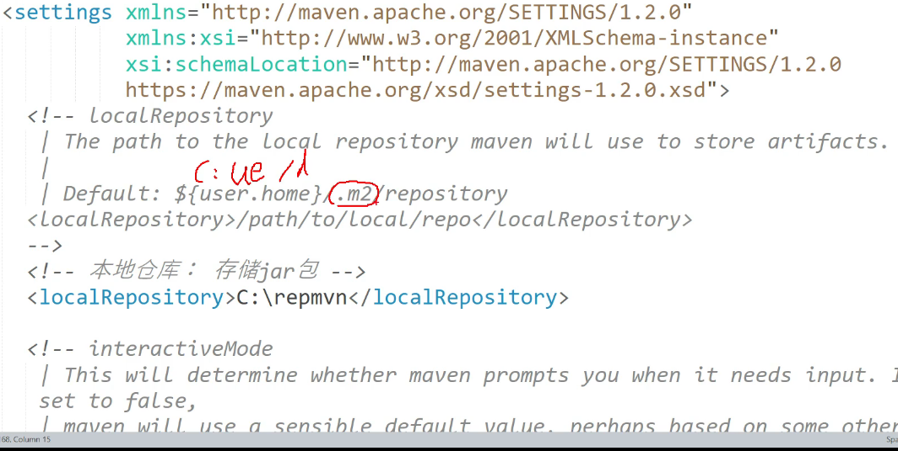
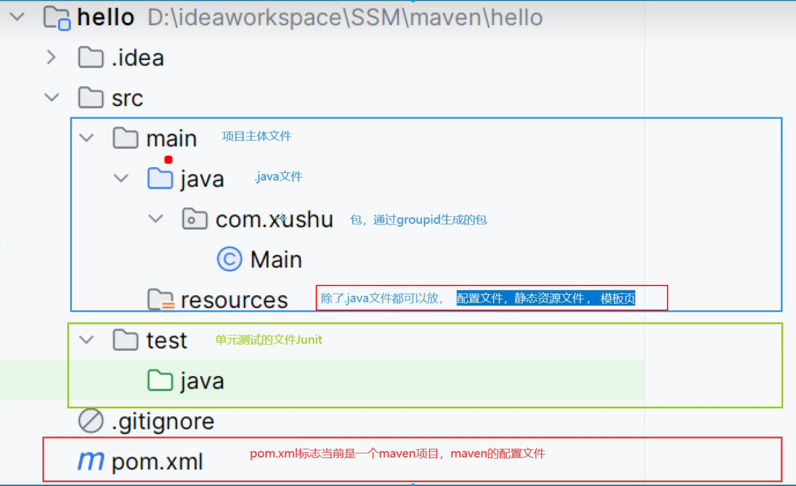

<div style="text-align: center;">
    <font size="10">Maven-Learning<br><font size="5" color="#008b8b">by shydoors</font></font>
</div>

返回基础的学习:[java](JL.md)

# Why learn?

- Maven是一个java项目的**构建**和**管理**工具，定义项目的结构，依赖和项目，并使用统一化的方式进行***自动化构建***
<br>maven的官网：[ApacheMaven](https://maven.apache.org/)
## 优势：
1. 对于.jar管理更有优势（直接用仓库进行管理，没有会从仓库里自动下载）
2. .jar间存在依赖关系的话，会自动下载有依赖关系的包（例如：jar1依赖jar2，引入了jar1,jar2也会自动引入的）

# 安装使用
1. 下载并解压后，打开后如下

2. 改配置
 - 找到conf文件里的seething，xml文件。
 - 本地的.jar库：<br>找到localRespository标签，标签内容就是本地的.jar仓库路径<br>所有的.jar都放这里，有需要的改一下
 - 修改.jar源：<br>
默认的.jar拉去网站是国外的，建议多配几个镜像
一个源找不到会从上往下找下一个源里的，jar
```xml
<mirror>
    <id>aliyunmaven</id>
    <mirrorOf>*</mirrorOf>
    <name>阿里云公共仓库</name>
    <url>https://maven.aliyun.com/repository/public</url>
</mirror><!--这个是阿里云-->
<mirror>
    <id>huaweicloud</id>
    <mirrorOF>*</mirrorOF>
    <url>https://repo.huaweicloud.com/repository/maven/</url>
</mirror><!--这个是华为云-->
```



```xml
<?xml version="1.0" encoding="UTF-8"?>
<project xmlns="http://maven.apache.org/POM/4.0.0"
         xmlns:xsi="http://www.w3.org/2001/XMLSchema-instance"
         xsi:schemaLocation="http://maven.apache.org/POM/4.0.0 http://maven.apache.org/xsd/maven-4.0.0.xsd">
    <modelVersion>4.0.0</modelVersion>
   
    <!--这一坨是该文件的’唯一地址‘ -->
    <!--专业人士也称其为坐标信息 
        调用文件时就是靠这一坨来识别
        -->
    <groupId>com.xushu</groupId>  <!--项目内部的模块名 -->
    <artifactId>hello</artifactId><!--对应的项目名字 -->
    <version>1.0-SNAPSHOT</version>
    <!--这里的version表示开发者自定义的版本
        开发者可能会写很多个版本的文件
        这个标签用于区别不同版本的文件
        
        这里的1.0-SNAPSHOT表示上线前的快照版本
        -->
    
    <!--.jar的引用 -->
    <dependencies><!--这个一般是‘依赖’的意思-->
        <dependency>
            <groupId>exmaple</groupId>
            <artifactId>hello</artifactId>
        </dependency>
        <dependency>
            <groupId>exmaple_1</groupId>
            <artifactId>hello_1</artifactId>
        </dependency>
    </dependencies>
    <!--引用-->
    
    
    <properties>
        <maven.compiler.source>17</maven.compiler.source>
        <maven.compiler.target>17</maven.compiler.target>
        <project.build.sourceEncoding>UTF-8</project.build.sourceEncoding>
    </properties>
</project>
```