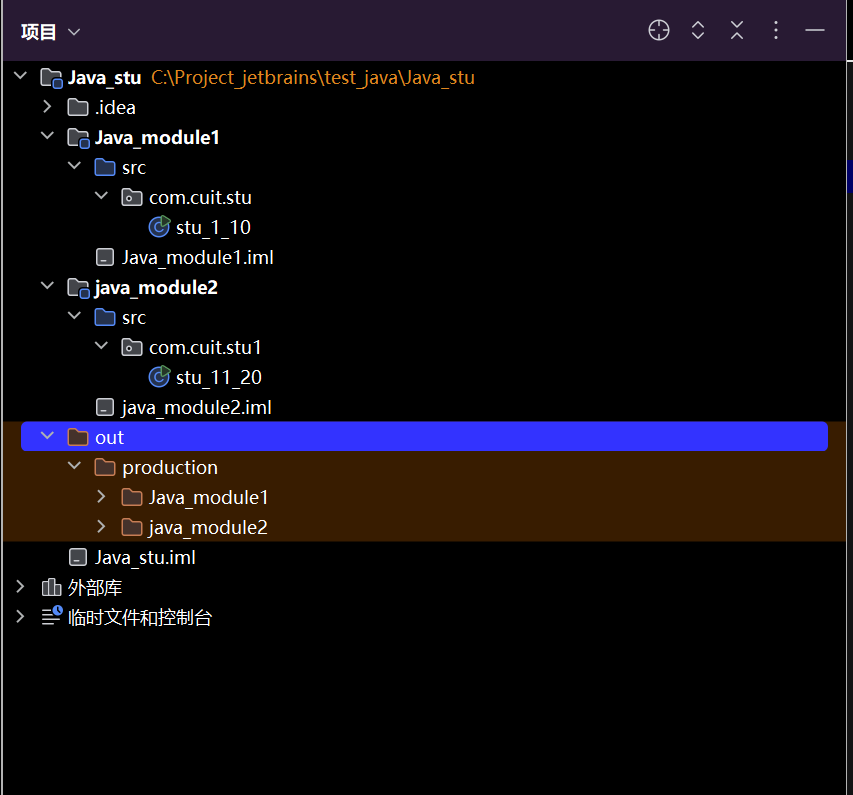
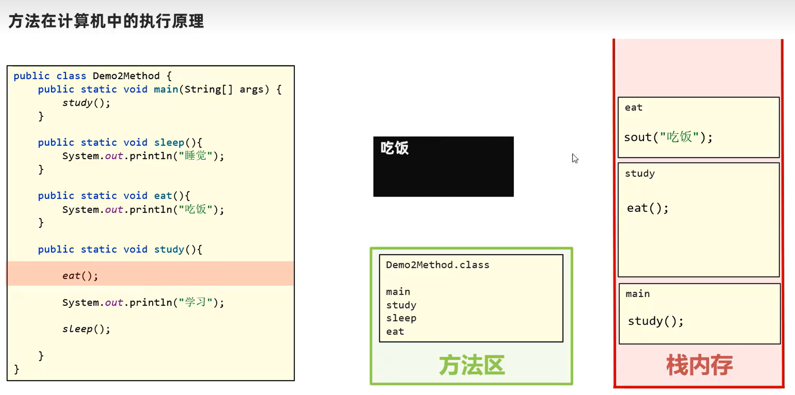
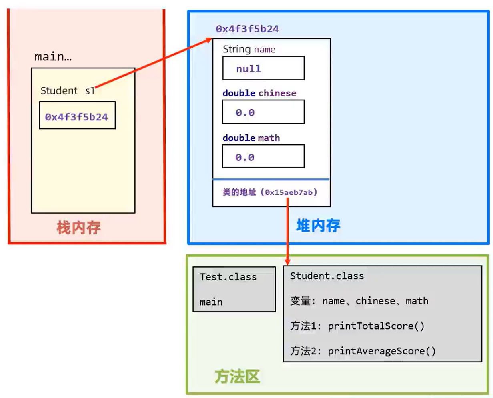
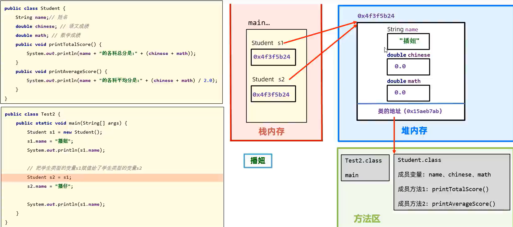

# JAVA_learn
<!-- javalearning_note by 2023051157,计科234,魏虹明-->

- 编译型语言：将code通过编译器编译成可执行文件，操作系统可运行该文件；e.g:Java的.java和.Class，C/C++的.cpp和.exe。
- 解释型语言：翻译一行代码执行一行，通过解释器运行代码。e.g.Python（事实上，Python两者都是）,JS

Java下载好JDK后（最好选择稳定版本的JDK，比如JDK8,JDK17）,可以在cmd面板中使用
## java常见cmd命令
Java 运行java的Class文件
<!--高版本JDK中，可以直接用Java命令运行java程序，但是由于CLass文件是缓存，运行后会删除，不建议这样操作-->
Javac 将Java文件（需要加后缀名）全编译成进行Class
javadoc
jar

## 项目建立

Projects(项目)->module(模块)->package(软件包)->Class(类)
Out文件：放置编译后的Class文件
反编译：将Class文件放入IDEA中，进行编译的过程。

```Java
//template
package com.cuit.stu;//软件包
public class stu_1_10 {
    public static void main(String[] args) {
        System.out.printf("Hello World");/**无自动换行*/
        System.out.println("Hello World");/**自动换行*/
        for (int i = 1; i <= 5; i++) {
            System.out.println("i = " + i);
        }
    }
}
//单行注释
/*
多行注释
*/

/** 
文档注释
*/

```
高版本IDEA中,编译运行后，项目下会自动生成out文件，并放入java生成的相应Class文件

例如这样：


## 变量

变量:用来存数据，本质上是内存中的一块区域

变量声明后才能使用，比如:

```java
int a=99;
```

|类型 |对应关键字 | 备注 |
| :----: | :-: |:--: |
| 整数   | byte/short/int/long|范围分别是： `[-2^7,2^7-1]，[-2^15,2^15-1],[-2^31,2^31-1],[-2^63,2^63-1]` |
| 浮点数  | float/double |      |
| 字符   | char | 单引号,允许各类字符，如汉字 |
| 字符串  |String |双引号|
|布尔型   | boolean|只有true和false|


### 关键字

java自带的一些字符，不允许作为变量名，函数名……不可以被重新定义，如Class,int,long,System

### 标识符

声明变量后，该变量的名字，可以由数字，字母，下划线，$……组成

例如：

```java
int a=66//int 为关键字，a为标识符
```
<font color="red">不能以数字，关键字开，区分大小写！</font>

计算机以二进制方式存数据,一个最小的数据单位叫做一个字节，详见数电_learn.md

## 运算符：


## 输入

库函数：

```Java	
package com.cuit.stu_Java_learn;//软件包
import java.util.Scanner;
public class stu_1_10 {
    public static void main(String[] args) {
        Scanner sc = new Scanner(System.in);
        long a = sc.nextLong();
        System.out.println(a);
    }
}
```

sc.next() 和 sc.nextLine 的区别
他们两个都是，区别在于：

—— next() 从遇到第一个有效字符开始扫描，遇到第一个空格或换行符结束。
—— nextLine() 则是扫描剩下的所有字符串知道遇到回车为止。

||同|异|
|-|-|-|
|sc.next()|用来接收用户的输入|遇到' '或'\n'结束输入，即：接收一个元素|
|sc.nextLine()||遇到'\n'结束输入,即：接收一整行|
```java
    public static void main(String[] args) {
        Scanner sc = new Scanner(System.in);//in: 11 11
        System.out.println(sc.next());//out: 11
    }
```
```java
    public static void main(String[] args) {
        Scanner sc = new Scanner(System.in);//in: 11 11
        System.out.println(sc.nextLine());//out: 11 11
    }
```

- 猜数游戏示例代码：

```java
package com.cuit.stu_Java_learn;
import java.util.Random;
import java.util.Scanner;
public class random_get {
    public static void main(String[] args) {
        Scanner sc = new Scanner(System.in);
        Random rand = new Random();
        int a=rand.nextInt(-100,100);
        while (true){
            Scanner sc1 = new Scanner(System.in);
            int x=sc1.nextInt();
            if(a==x){
                System.out.println("猜对了，就是"+a);
                break;
            }else if(x>a){
                System.out.println("猜大了");
            }else if(x<a){
                System.out.println("猜小了");
            }
        }
    }
}
```
## 数组

- 静态数组，内容，长度确定

- 动态数组，内容不确定，长度手动输入

  直接打印数组名时**会输出数组的地址**：

比如：

大写的字母I表示数组的元素时int型，@后面接实际地址

```java
package com.cuit.stu_Java_learn;//静态数组示例
import java.util.Scanner;
public class x1 {
    public static void main(String[] args) {
        int[] arr = {1,2,3,4,5,6,7,8,9,10};
        for(int i:arr){
            System.out.printf(i+" ");
        }
    }
}
```
```java
package com.cuit.stu_Java_learn;//动态数组示例
import java.util.Scanner;
public class x2 {
    public static void main(String[] args) {
        int[] arr = new int[10];
        Scanner sc=new Scanner(System.in);
        for(int i=0;i<10;++i){
            arr[i]= sc.nextInt();
        }
        for(int i:arr){
            System.out.printf(i+" ");
        }
    }
}
```
```java
package com.cuit.stu_Java_learn;//多维数组示例
import java.util.Scanner;
public class x3 {
    public static void main(String[] args) {
        Scanner sc = new Scanner(System.in);
        int col=sc.nextInt();
        int row = sc.nextInt();
        sc.nextLine();
        int[][] arr4 = new int[row][col];
        for (int i = 0; i < row; i++) {
            for (int j = 0; j < col; j++) {
                arr4[i][j] = sc.nextInt();
            }
        }
        for (int[] val1 : arr4 ) {
            for (int val : val1) {
                System.out.printf(val+" ");
            }System.out.println();
        }
    }
}
/*3行4列矩阵存入和输出 
3 4
1 5 6 8
9 15 6 11
33 55 100 101
*/
```
## Java内存分配

- 方法区：字节码文件（即：Class文件）加载的区域
- 栈：方法运行时所存入的内存，比如：main()方法
- 堆：new 函数开辟的空间，比如动态数组的空间，声明<font color="red">静态数组</font>时，其实也用了new方法，静态数组其实也存放在堆空间中

   ```java
   package com.cuit.stu_Java_learn;//静态数组示例
   public class x1 {
       public static void main(String[] args) {
           int[] arr = {1,2,3,4,5,6,7,8,9,10};
           System.out.println(arr);
           for(int i:arr){
               System.out.printf(i+" ");
           }
       }
   }
   ```

- 本地方法栈（略）
- 程序计数器（略）


## 方法

```java
package com.cuit.stu_Java_learn;
import java.util.Scanner;
public class x4 {
    public static void main(String[] args) {
        Scanner sc = new Scanner(System.in);
        int a = sc.nextInt();
        int b = sc.nextInt();
        System.out.println(sum(a,b));
    }
    public static int sum(int a, int b) {//方法的定义
        return a + b;
    }
    //private : 在同一类内可见。使用对象：变量、方法。 注意：不能修饰类（外部类）
    //public:对所有类可见。使用对象：类、接口、变量、方法
    //protected:对同一包内的类和所有子类可见。使用对象：变量、方法
    //default关键字表示默认的，能被定义它的类和同一个包中的其他类访问
    //final关键字表示最终的，不能被继承或修改
    //static关键字表示静态的方法，能被类的所有实例对象共享
    //控制访问权限的关键字，详见类的部分
}
```

### <font  color="pink">**几个注意**</font>

- 无所谓方法在类里的位置
- 方法内不可再定义一个方法，尤其是<font color="red">main</font>方法中

- void 表示无返回变量，可以不用`return`

- `return `关键字下面不用再写代码了

- `java方法`形参不支持初始值，数据传入时必须<font color="red">严格与形参</font>列表对应

  >
  > ```java
  > package com.cuit.stu_Java_learn;
  > public class x4 {
  > public static void main(String[] args) {
  >   System.out.println("Hello World");
  > }
  > public static int SUM(int a=0, int b) {//这里的 a = 0 会报错
  >   return a + b;
  > }
  > }
  > ```

- 这个特性不太好描述，直接看代码吧。

  >
  > ```java
  > package com.cuit.stu_Java_learn;
  > public class x4 {
  > public static void main(String[] args) {
  >   System.out.println("Hello World");
  >   SUM(10,11)
  >       //虽然没有将这个方法的返回变量赋给任意一个变量，
  >       //但它确确实实运行了一下，没有报错。
  >       //连警告都没有
  > }
  > public static int SUM(int a, int b) {
  >   return a + b;
  > }
  > }
  > ```
>

### 方法的运行

**栈的特点**

- 先进后出（First-In-Last-Out）,FILO原则。

先将main函数中的方法加载到方法区，然后方法区内先调用main方法，再根据main方法调用其他方法

示例：在例子中，先调用study()方法，运行，发现要调用eat()，调用eat()，<font color="red">运行</font>(方法在栈内存中运行！！！)，输出，eat()运行结束，栈中释放eat()，返回study()，发现要调用sleep()，调用运行，输出睡觉，结束运行。




### 参数

- 形参:方法声明时的变量
- 实参:方法内部定义时的变量
>```java
>public int change(int c){//这里的c为形参
>    int a=c+1;//这里的a为实参
>   return a;
>}
>```

**值传递**

#### **基本数据类型**

- 在传输实参给方法 的形参时，传的是实参变量中，存储值的副本

  > [!NOTE]
  >
  > 是副本！！！不会改变原来的实参的值！！！
  >
  > 如果要改原有的值，需要加关键字！！！

like this:


#### **引用数据类型**

由于传递数组时，传递的时地址，所以在方法内修改值时，实参也会改

like this:

```java
package com.cuit.stu_Java_learn;
public class x5 {
    public static void main(String[] args) {
        int[] a={0,1,2};
        System.out.println("实参原值a["+1+"] = "+a[0]);
        swa1(a);
        System.out.println("实参修改后，a["+1+"] = "+a[0]);
    }
    public static void swa1(int[] a){
        System.out.println("形参修改前："+a[0]);
        a[0]=99;
        System.out.println("形参修改后："+a[0]);
    }
}
```

```out
实参原值a[1] = 0
形参修改前：0
形参修改后：99
实参修改后，a[1] = 99

```

#### <font color='red'>数据的复制</font>IMPORT

引用类型的数据，用copy进行赋值，否则只是将地址赋给新的数组

```java
package com.cuit.stu_Java_learn;
public class x6 {
    public static void main(String[] args) {
        int[] a={0,1,2};
        int[] arr=copy(a);
        int[] arr2=new int[arr.length];
        copy1(arr2,a);
        for(int i:arr){
            System.out.printf(arr[i]+",");
        }System.out.println();
        for(int i:arr2){
            System.out.printf(arr2[i]+",");
        }
    }
    public static int[] copy(int[] a){
        int[] arr=new int[a.length];
        for(int i=0;i<a.length;++i){
            arr[i]=a[i];
        }return arr;
    }
    //也有其他的复制数组的方法
    public static void copy1(int[] arr,int[] a){
        System.arraycopy(a, 0, arr, 0, a.length);//这行代码表示，从a[0]开始数（含a[0]）的a.length个元素。
        //赋给arr数组，从arr[0]开始，即：arr[0]=a[0],arr[1]=a[1]之类的
    }//注意数组越界问题
}
```

## 类

<div style="display: flex; flex-direction: row;">
  <p style="text-align: center;">万物皆对象！！！</p>
  <p style="text-align: right;">    <br><br><br><br> --James Gosling（java之父）</p>
  
</div>
**e.g.**

```Java
package com.cuit.ForPlaying.calendar;
import java.util.Scanner;
public class Main {
    public static void main(String[] args) {
//        Scanner input = new Scanner(System.in);
//        int year=input.nextInt();
//        int month = input.nextInt();
        int year=2020, month=1;
        Calendar x = new Calendar(year,month);
        System.out.println(x.year);
    }
}
class Calendar{//日历类
    int year;//数据
    int month;//数据 属性 
    private int[] mon={0,31,28,31,30,31,30,31,31,30,31,30,31};//数据
    private int[] mons={31,59};//数据
    public Calendar(int year, int month) {
        /*方法 函数 行为*/
        this.year = year;
        this.month = month;
    }//给定初值时的初始化
    public Calendar() {
        this.year = 1800;
        this.month = 1;
    }//未输入初值时的初始化
    //这种写法叫重载
}
```

> [!CAUTION]
> 在一个.java文件中，只能有一个public类

### 地址的注意

一个实例会有两个地址，方法区中类的地址，堆内存中的对应对象的地址这个例子中，

- 对象的地址：0x4f3f5b24

- 类的地址：0x15aeb7ab

执行对象内部的行为时，先通过对象的地址找到类的地址，再通过类的地址找到行为



1. 一个代码文件内只能有一个public 修饰的类，且代码文件名必须和该类名一致

2. 对象与对象之间的属性互不影响

3. 对象与对象之间的‘ = ’运算符，传递的是地址

   

最好自己手写一个copy行为。这个图片内的代码为例：

```java
class Student{
    String name;
    double Chinese;
    double Math;
    public void printTotalScore() {
        System.out.println(name +"的各科总分是:"+(Chinese + Math));
    }
    public void printAverageScore() {
        System.out.println(name +"的各科平均分是:"+(Chinese + Math) / 2.0);
    }
    public Student(Student other) {
        this.name = other.name;
        this.Chinese = other.Chinese;
        this.Math = other.Math;
    }
}
```

### this关键字

this会优先调用内部的属性

```java
    public void printf_this() {
        System.out.println(this);
    }//this会传递对象的地址class Student{
    String name;
    double Chinese;
    double Math;
    public void printTotalScore() {
        System.out.println(name +"的各科总分是:"+(Chinese + Math));
    }
    public void printAverageScore() {
        System.out.println(name +"的各科平均分是:"+(Chinese + Math) / 2.0);
    }
    public Student(Student other) {
        this.name = other.name;
        this.Chinese = other.Chinese;
        this.Math = other.Math;
    }
    public void printf_this() {
        System.out.println(this);
    }//this会传递对象的地址
}
```


返回的是堆内存处的地址

### 构造器
```java
//example

public class x4 {
  public static void main(String[] args) {
    String name;
    double soc;
    STU y1=new STU();
    y1.name="xxx";
    y1.socs=3.14;
    //或者这样
    STU y2=new STU("yyy",6.28);
  }
}
class STU{
    String name;
    double socs;
    public STU(String name,double socs){
        this.name=name;
        this.socs=socs;
    }
}
```


### 封装规范

**一个原则**：<font color='red'>合理暴露，合理隐藏</font>
各类关键字的效果表

| 关键字 | 效果 |
| :- | :- |
|public   |外界可以访问|
|private |只能被同一个类中的其他成员访问，不能被其他类访问，包括子类|
|protected |只能被同一个包中的类或其子类访问 |
|default|可以被同一个包中的类访问|
|final|用于修饰类、方法和变量，表示这些类、方法和变量不能被继承、重写或修改，多用于全局变量|
|static|用于修饰类的成员变量和成员方法，表示这些成员变量和成员方法属于类本身，而不是属于类的实例。将类视作一个程序，而这个关键字修饰的内容则是程序框架，不是变量，函数……|
|abstract| 用于修饰类和方法，表示这些类和方法是抽象的，不能被实例化或直接调用。 |
|interface| 用于定义接口，表示一组抽象方法的集合|
|enum| 用于定义枚举类型，表示一组固定的常量值|
|synchronized| 用于修饰方法和代码块，表示这些方法和代码块是线程安全的|
|volatile|用于修饰变量，表示这些变量的值可能会被多个线程同时访问和修改|
|transient|用于修饰变量，表示这些变量的值不应该被序列化|

### JavaBean

这是一种特殊的类

特点：

1. 成员变量(属性)全员私有（private）,但每个属性都有对应的get,set函数
2. 类中有一个公共的无参构造器
> 工程中，类的内部属性太多了，内部再定义一个JavaBean，仅仅只是为了封装那些数据需要输入输出的数据
>
> 即：数据和数据的业务处理相分离

### [<font color='red'>常见API</font>:]( https://java.cunzaima.cn/jdk21/doc-zh/api/java.base/java/lang/StringTemplate.html)

#### String 

1. 为基本数据类型，存储为的地址

2. new 一个字符串时，可以自动将char 数组，bytes数组，转为String

   ```java
   String x1=new String();//空字符串
   String x2="x1+x2";
   String x3=new String("x1+x2");//内容为x1+x2,emm,多此一举，直接用=进行初始化就是了呗
   char[] ch_s={'a','魏','虹','明'};
   String x4=new String(ch_s);//内容是"a魏虹明"
   byte bys={'97','98','99'};
   String x5=new String(bys);
   /*
   * the output of x5 r 'abc' according to ASCII code
   * 1. turn the byte's into char's.
   * 2. link the char one by one in order.
   */
   ```

3. **commom methods**

   |type of var(in)| type of var(out)  | method |desc|
   |:--- | :--- | :---- | :------ |
   |String | String |  substring(idx_begin,idx_end)  |保留下标在[idx_begin,idx_end]内的字符，其余舍弃（包前不包后）<br>首字符对应的下标为0<br>e.g. x="A:123"  x.substring(2) -> "123"|
   |String|String[]|split()|默认以‘ ’为分割符将String分割开来，也可以是某个字符，或某个字符串。注意，首元素一般是空字符串<br><font color='red'>对，空的字符串也是一个字符串</font>,刚学的时候，花了一个下午才找到这个bug<br>"#A:111 #A:11" -> ["","111","11"]|
   


4. 注意事项

   > String 类的对象不可变字符串对象
   >
   > 对字符串的处理本质上是对字符串常量的处理，产生了新的String类的对象

   

> 常量池：
>
> 用双引号括起来的字符串作为字符串常量存放在堆内存中
>
> String实际上存放的是字符串的<font color='red'>地址</font>，比较字符串是否相等时，最好用equals(),不考虑大小写时用equalsIgnoreCase()
>
> 


```java
char[] ch_s={'A','B','C'};
String s1=new String(ch_s);
String s2=new String(ch_s);
String s3="ABC";// 因为 内容一致
String s4="ABC";// 所以 在堆内存.常量池中中的地址也是一致的
System.out.println(s1==s2)         //输出 false
System.out.println(s1.equals(s2))  //输出 true
System.out.println(s3==s4))        //输出 true
System.out.println(s3.equals(s4))  //输出 true
    /*
    * new出来的数据都是放在堆内存中的
    * 输出false，因为new出来的String地址不一致
    * 用equals()就对了,emm,想念C++的第一天
    */
```

#### ArrayList

1. 集合 容器

2. 常见的方法

   
3. 几个注意
> ArrayList,参考python中list类
>
> ```java
> ArrayList arr=new ArrayList();//这是一个泛型类，什么类型都能存
> ArrayList<int> arr=new ArrayList<int>();//这样就只能放进int型
> ```
>
> add(int idx ,E e);在索引为idx和idx-1之间插入一个元素。
>
> 注意：remove()方法有返回值
>
> set(int idx,E Elem);替换方法，将索引为idx处的元素替换为Elem,并返回修改之前的元素。

## 类的进一步学习

### static

> [!important]
> 有static的成员变量，方法叫类变量，类方法（也有静态变量，静态方法的说法）
>
> - 凡是静态的变化，都会作用于所有类,且只会加载一次，能很好的减少内存。由于这个特性，经常被用于写一些程序员调试用的方法
>
>   这些方法被统称为工具类。典型的工具类就是Math
>
>  其余的叫实例变量，实例方法（也有动态变量，动态方法的说法）


这个例子中，哪怕只是对另一个类进行修改，所有的类中的String name也会被修改。可以用来实现DFS,BFS等算法，被类和类的所有对象所共有。

> [!WARNING]
>
> >  main方法中其实也可以接收数据，甚至可以拿来用
>
> 

#### 注意

>[!important]
>
>1. 类方法中不允许有this关键字
>2. 可访问类的成员，但不可以直接访问实例成员
>3. 实例可以访问类的成员,或方法（不建议用实例访问类方法）
>

### 代码块的应用

- 类代码块er，加载类的时候运行，只运行一次，且先于构造器运行

- 实例代码块er，创建类的实例的时候运行，多少个实例就运行多少次，先于构造器

  格式

  

 #### 设计模式（design pattern）

1. 创建型：

>
>- 单例设计模式（饿汉式）：这样这个类能且只能声明一个实例对象
>
> ```java
> class A{
>     private static A a = new A();//定义一个类变量，来储存类
>     private A(){//构造器私有
>     }
>     public static A getObject(){
>         return a;//写一个类方法进行创建实例类
>     }
> }
> //拿对象时，对象创建好了，典型的有Runtime（获取程序运行时间的类）,任务管理器
> ```
>
>- 单例设计模式（懒汉式）
>
> ```java
> class B{
>   private static B b;  //定义一个类变量，来存储类
>     private B(){}//构造器私有
>        public static B getInstance(){
>            if(b==null){b=new B();}
>            return b;//用的时候现场new一个
>     }
> }
> //拿对象时才去创建对象
> ```
>
>- **原型模式**（Prototype Pattern）：通过复制现有的实例来创建新的实例。
>- **工厂模式**（Factory Pattern）：通过工厂类创建对象，而不是直接使用new关键字。
>- **抽象工厂模式**（Abstract Factory Pattern）：创建一系列相关或依赖对象的接口，而无需指定它们具体的类。
>- **建造者模式**（Builder Pattern）：逐步构建一个复杂的对象，允许用户只通过指定复杂对象的类型和内容就可以构建它们

2. 结构型：
 >|name | use for|
 >|:-|:--|
 >|**适配器模式**（Adapter Pattern）|允许不兼容的接口之间进行通信|
 >| **组合模式**（Composite Pattern） | 允许将对象组合成树形结构以表示“部分-整体”的层次结构 |
 >|**适配器模式**（Adapter Pattern）|允许不兼容的接口之间进行通信|
 >| **组合模式**（Composite Pattern）|允许将对象组合成树形结构以表示“部分-整体”的层次结构|
 >| **装饰器模式**（Decorator Pattern）|动态地给一个对象添加一些额外的职责|
 >| **外观模式**（Facade Pattern）|提供一个统一的接口，用来访问子系统中的一群接口|
 >| **享元模式**（Flyweight Pattern）|通过共享技术支持大量细粒度对象的复用|
 >| **代理模式**（Proxy Pattern）|为其他对象提供一种代理以控制对这个对象的访问|
 >| **桥接模式**（Bridge Pattern）|将抽象部分与实现部分分离，使它们都可以独立地变化|
3. 行为型：
>|name | use for|
 >|:-|:--|
 >| | |
 
### 继承

```java
public B extends A(){
    
}//B继承A
//B为子类，能继承父类的非私有属性，方法
//A为父类（基类，超类）
```


>  [!warning]
>
>  单继承性：一个子类不能同时继承多个父类。好比一个人不能同时是2个人的儿子（干儿子不算，别杠）
>
>  多层继承：子类可以作为父类被继承

### 封装

### 多态

  


- 接口（interface）

- 抽象类（abstract）

  |方面 | 具体区别 |
  | :--: | :--- |
  | 抽象对象|抽象类：一种事物的抽象，即对类抽象<br>接口：行为的抽象 |
  |语法层面|抽象类可以提供成员方法的实现细节<br>接口中只能存在public abstract方法|
  |成员变量|抽象类中的成员变量可以是各种类型的<br>接口中的成员变量只能是public static final类型|
  | 方法 | 接口中不能含有静态代码块和静态方法<br>抽象类可以有静态代码块和静态方法 |
  | 继承 | 一个类只能继承一个抽象类<br>一个类却可以实现多个接口 |

```Java
public class AlarmDoor extends Door implements Alarm {
    public void open() {
        // 实现open方法
        //手动实现该行为
    }

    public void close() {
        // 实现close方法
    }

    public void alarm() {
        // 实现alarm方法
    }
}

//抽象类
public abstract class Door {
    int a=1;//必须初始化变量
    public abstract void open();//不能有代码块儿
    public abstract void close();//只能有声明
    public abstract void sound();
    public static void eat() {
        System.out.println("动物吃东西");
    }
}
//接口
public interface Alarm {
    void alarm();//
}
```
### 说明：
| name         | desc                                                                                    |
|--------------|:----------------------------------------------------------------------------------------|
| JavaBean     | 1. 只有数据                                                                                 |
| Interface    | 1. 只有行为的端口，无行为的具体内容，即：无代码块<br/>2. 只有行为的端口<br/>3.子类可以继承多个接口(用implements)                 |
| abstract class| 1. 类的模板（行为只有定义,无具体内容）<br/>2. 可以有数据，具体行为只能在子类中override<br/>3. 子类继承一个&#40;用extends&#41;，不可被访问，实例化 |
## 枚举（enum）
- 枚举类的<font color='red'>第一行</font>只能罗列一些名称,这些名称都是常量(由public static finaly修饰),并且每个常量记住的都是枚举类的一个对象。
>
- 枚举类的构造器都是私有的(写不写都只能是私有的),因此,枚举类对外不能创建对象。
- 枚举都是最终类,不可以被继承。
- 枚举类中,从<font color='red'>第二行</font>开始,可以定义类的其他各种成员。
- 编译器为枚举类新增了几个方法,并且枚举类都是继承:java.lang.Enum类的,从enum类也会继承到一些方法
## 泛型（genalize object）
### 使用
对应C++的容器

| name  | 注解 |
|-------|----|
|List| 表  |
|Set| 集合 |
|Map| 哈希 |
```java
@ Test
public void test() {
    ArrayList<String> list = new ArrayList<>();
    list.add("aaa");
    list.add("bbb");
    list.add("ccc");
    for (int i = 0; i < list.size(); i++) {
        System.out.println((String)list.get(i));
    }
}
```
```out
aaa
bbb
ccc
```
### 备注
1. - [!warning]
在泛型类的类型参数未确定时，静态成员有可能被调用 
> 因此泛型类的类型参数是不能在静态成员中使用的<br/>
> 泛型类不可以加static关键字
2. 泛型类不只接受一个类型参数，它还可以接受多个类型参数
- 不传入时默认Object
- > | 简写 | 含义 |
  > |----|------|
  >| T  | 代表一般的任何类                            |
  >| E  | 代表 Element 元素的意思，或者 Exception 异常的意思 |
  >| K  | 代表 Key 的意思                          |
  >| V  | 代表 Value 的意思，通常与 K 一起配合使用           |
  >| S  | 代表 Subtype 的意思，文章后面部分会讲解示意          |


e.g.
```java
//泛型方法
public class Test<U> {
    // 该方法只是使用了泛型类定义的类型参数，不是泛型方法
    public void testMethod(U u){
        System.out.println(u);
    }

    // <T> 真正声明了下面的方法是一个泛型方法,其中的T表示new方法时传入的一个参数
    public <T> T testMethod1(T t){
        return t;
    }
} 
//泛型接口
interface IUsb<U, R> {
    int n = 10;
    U name;// 报错！ 接口中的属性默认是静态的，因此不能使用类型参数声明
    R get(U u);// 普通方法中，可以使用类型参数
    void hi(R r);// 抽象方法中，可以使用类型参数
    // 在jdk8 中，可以在接口中使用默认方法, 默认方法可以使用泛型接口的类型参数
    default R method(U u) {
        return null;
    }
}
```
## 原子类（Objetc）
**Object**是所有类的祖宗，所以Object的方法，所有类都可以用
> | 常用类|                       |
> |----|-----------------------|
> | public String toString | 返回字符串的表示形式            |
> | public boolean  equals(Ob) | 判断两个类是否相等（默认比较地址），注意要重写 |
> | protcted Object clone | 对象克隆                  |
## IO

API java.base.java.io
## 一项目处理时的特殊文件
### .txt
- 随便写东西
- 怎么读出来，怎么处理就看个人了
### .properties 
- 属性文件
- 只能存键值对
- 格式如下
- ```properties
  # 这样写注释
  # 可以用来存用户的账号名字和密码信息
  admin=123 
  #键在前，值在等号后面是properties文件的标准格式
  #不可以在键值对后面加注释
  lis=liss
  全蛋=volunteermyant
  # 这是一个注释
  database.url=jdbc:mysql://localhost:3306/mydb
  database.username=root
  database.password=123456
  ```
### .xml
[java的xml讲解](https://blog.csdn.net/weixin_44105632/article/details/126805910?ops_request_misc=%257B%2522request%255Fid%2522%253A%2522E527B400-BB4C-4C9B-953D-6C46AB923D71%2522%252C%2522scm%2522%253A%252220140713.130102334..%2522%257D&request_id=E527B400-BB4C-4C9B-953D-6C46AB923D71&biz_id=0&utm_medium=distribute.pc_search_result.none-task-blog-2~all~top_click~default-1-126805910-null-null.142^v100^pc_search_result_base7&utm_term=java%20xml&spm=1018.2226.3001.4187)
- 属性文件
- 示例xml
```xml
<?xml version="1.0" encoding="UTF-8"?>
  <users>
    <!-- 这是一个注释 -->
    <!-- 这个注释方式让我想起了html-->
    <user id="1">
        <name>John Doe</name>
        <email>john.doe@example.com</email>
        <age>30</age>
    </user>
    <user id="2">
        <name>Jane Smith</name>
        <email>jane.smith@example.com</email>
        <age>25</age>
    </user>
</users>
```
- 调用xml的示例代码
```java
import org.w3c.dom.*;
import javax.xml.parsers.*;
import java.io.File;
/**
 * 虽然IDEA会自动补齐需要调用的口语
 * 但还是要注意一下这些库
 */
public class XMLReader {
    public static void main(String[] args) {
        try {
            // 创建一个DocumentBuilderFactory
            DocumentBuilderFactory factory = DocumentBuilderFactory.newInstance();
            // 创建一个DocumentBuilder
            DocumentBuilder builder = factory.newDocumentBuilder();
            // 解析XML文件并获取Document对象
            Document document = builder.parse(new File("users.xml"));//这里调用
            // 获取根元素
            Element root = document.getDocumentElement();
            System.out.println("Root element: " + root.getNodeName());

            // 获取所有user元素
            NodeList userList = document.getElementsByTagName("user");

            // 遍历user元素
            for (int i = 0; i < userList.getLength(); i++) {
                Node userNode = userList.item(i);
                if (userNode.getNodeType() == Node.ELEMENT_NODE) {
                    Element userElement = (Element) userNode;
                    String id = userElement.getAttribute("id");
                    String name = userElement.getElementsByTagName("name").item(0).getTextContent();
                    String email = userElement.getElementsByTagName("email").item(0).getTextContent();
                    String age = userElement.getElementsByTagName("age").item(0).getTextContent();

                    System.out.println("User  ID: " + id);
                    System.out.println("Name: " + name);
                    System.out.println("Email: " + email);
                    System.out.println("Age: " + age);
                    System.out.println();
                }
            }
        } catch (Exception e) {
            e.printStackTrace();
        }
    }
}
```
- 添加依赖项（默认maven）
```xml
<dependency>
    <groupId>org.w3c.dom</groupId>
    <artifactId>dom</artifactId>
    <version>3.0.0</version>
</dependency>
```
### .json


## 线程||超线程||进程
多线程：软硬件上实现多条执行流程的技术（CPU负责调度执行）
```java
public class Main {
    public static void main(String[] args) {
        PrimeThread x1=new PrimeThread();
        x1.start();
        for(int i=1;i<=5;i++) {
            System.out.println("主线程运行了",i);
        }/**
         * 开启线程
         * 启动后便调用run方法
         * */
    }
}
class PrimeThread extends Thread { 
    long minPrime;
    PrimeThread (long minPrime) {
        this.minPrime = minPrime;
    }
    @Override
    public void run() {
        // compute primes larger than minPrime
        for(int i=1;i<=5;i++) {
            System.out.println("子线程运行了",i);
        }
    }
}
```
运行结果：


主线程和子线程并不能实现真正意义的并行。只能**高频**，**随机**地交替运行
这样创建的线程
优点：编码简单
缺点：已继承了Thread类，无法再继承其它的类了
所以，一般用的是另外的线程创建方法，示例代码如下
```java
public class Main {
    public static void main(String[] args) {
        PrimeThread x1=new PrimeThread();
        new Thread(x1).start();
        /**
         * x1实际上是任务类，将任务类x1传递给线程类
         */
        for(int i=1;i<=5;i++) {
            System.out.println("主线程运行了",i);
        }/**
         * 开启线程
         * 启动后便调用run方法
         * */
    }
}
class PrimeThread implements Runnable { 
    long minPrime;
    PrimeThread (long minPrime) {
        this.minPrime = minPrime;
    }
    @Override
    public void run() {
        // compute primes larger than minPrime
        for(int i=1;i<=5;i++) {
            System.out.println("子线程运行了",i);
        }
    }
}//重新写一个接口
```
## [maven的学习](MavenLearn.md)