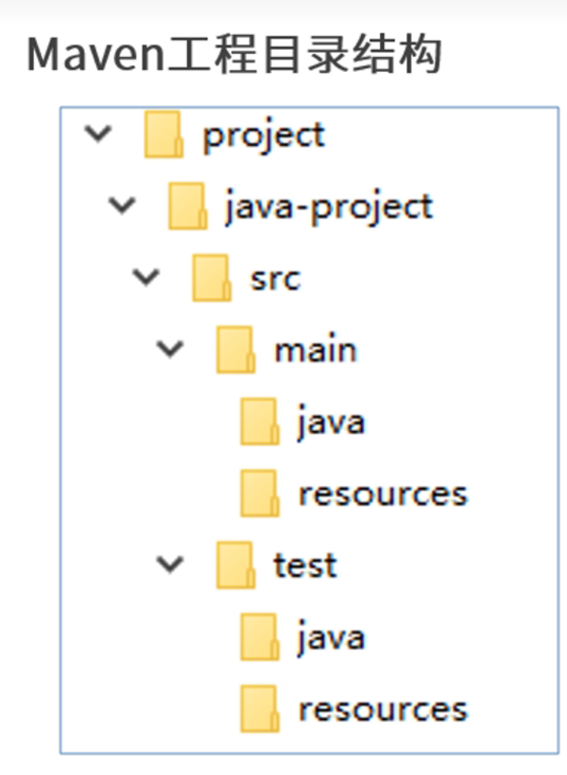
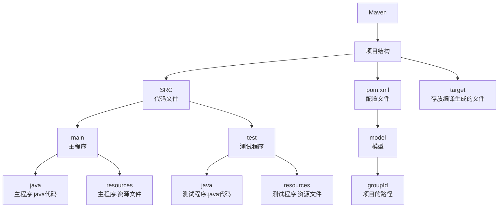
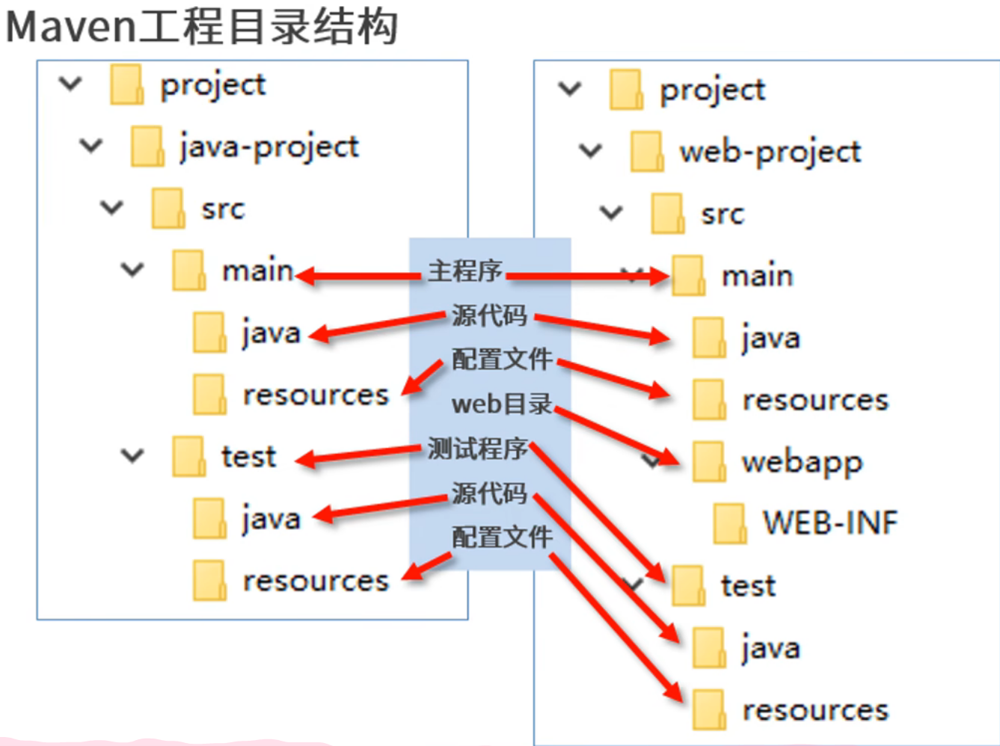

<div style="text-align: center;">
    <h1 style="font-size: 3em;">Maven-Learning</h1>
    <h2 style="font-size: 2em; color: #008b8b;">by shydoors</h2>
</div>

返回基础的学习:[java](JL.md)

# Why learn?

- Maven是一个java项目的**构建**和**管理**工具，定义项目的结构，依赖和项目，并使用统一化的方式进行***自动化构建***
<br>maven的官网：[ApacheMaven](https://maven.apache.org/)
## 优势：
1. 对于.jar管理更有优势（直接用仓库进行管理，没有会从远程的仓库里自动下载）
2. .jar间存在依赖关系的话，会自动下载有依赖关系的包（例如：jar1依赖jar2，引入了jar1,jar2也会自动引入的）

## 概念:

### 仓库
> 仓库: 用于存储资源,包含各种jar包<br>

仓库分类:
>本地仓库: 自己电脑上存储资源的仓库, 连接远程仓库获取资源
>远程仓库: 非本机电脑上的仓库, 为本地仓库提供资源
> > 中央仓库: Maven团队维护, 存储所有资源的仓库<br>
> 私服: 部门/公司范围内存储资源的仓库, 从中央仓库获取资源

1. 私服的作用:保存具有版权的资源, 包含购买或自主研发的jar
2. 中央仓库中的jar都是开源的, 不能存储具有版权的资源
3. 一定范围内共享资源, 仅对内部开放, 不对外共享

### 坐标
```xml
<groupId>
    <groupId>com.ds.stu</groupId><!--项目的路径-->
    <artifactId>cuit</artifactId> <!-- 项目ID -->
    <version>1.1-SNAPSHOT</version> <!-- 项目版本 -->
</groupId>
```
源代码的路径是src/main/java/com/ds/stu/
代码名字是cuit.java
### 镜像源

```xml

<mirrors>
    <mirror>
        <id>nexus-aliyun</id><!--镜像源的id-->
        <mirrorOf>central</mirrorOf><!--表示为中央仓库-->
        <name>NexusAliyun</name><!--镜像源的名字,取什么无伤大雅-->
        <url>https://maven.aliyun.com/nexus/content/groups/public</url>
        <!--maven在下载.jar文件时会就是从这个url下载-->
    </mirror>
</mirrors>
```
## 工程结构


建议在学习过程中，使用[***Intellij IDEA***](https://www.jetbrains.com/idea/)进行开发<br>
并下载有关<font color='red'>PlantUML</font>插件，进行学习

> [!note]
>
> pom.xml 为项目的配置文件<br>
> src 文件夹下的文件为项目的源代码文件<br>
> 且必须和pom.xml在同一个文件夹里的同一级目录下<br>
> 生成的target文件夹是编译后的文件，也和src在同一个文件里同一级<br>


# pom.xml
配置文件（示例）
```xml
<project xmlns="http://maven.apache.org/POM/4.0.0"
         xmlns:xsi="http://www.w3.org/2001/XMLSchema-instance"
         xsi:schemaLocation="http://maven.apache.org/POM/4.0.0 http://maven.apache.org/xsd/maven-4.0.0.xsd">
    <modelVersion>4.0.0</modelVersion>
    <!--
    pom.xml其实是一种设计模型
    modelVersion时模型的版本，不是maven的版本号。
    maven的版本号是在pom.xml中定义的 
    -->
    <groupId>com.ds.stu</groupId>
    <artifactId>java_pro</artifactId><!--项目名称-->
    <packaging>jar</packaging><!-- 打包类型 -->
    <!--
    实际的地址是Main.com.ds.stu
    -->
<!--    
    <packaging>jar</packaging>
-->
    <!-- 打包类型,慎用 -->
    
    <version>1.1.0-SNAPSHOT</version>
    <!--
    版本号可以随便写，但是最好是数字，尽量别用字母
    SNAPSHOT快照的意思，一般是开发人员调试用的
    比如python3.12.6 正式版本
    这是一个标准的的版本号，
    3表示主版本号（Major Version）,主版本号在进行不兼容的 API 修改时增加。
    12表示次版本号（Minor Version）,次版本号在添加功能时增加,但不影响现有功能的兼容性。
    6表示修订号（Patch Version）改动越大，版本号改动就越靠前,修订号在进行向后兼容的问题修复时增加
    例如:
    
    - python2到python3,有些语法都不支持了，这种改动就比较大
    
    - Python 3.8 和 Python 3.9 之间，Python 3.9 引入了一些新特性，比如字典合并运算符(|)
      但这些新特性不会破坏现有的代码。用户可以选择使用新特性，而不必担心旧代码的兼容性。
    - 2.3.0及其以后，python自带的sort()函数就是用的时TimSort(),具体是插入排序的进阶版
    python3.12.6到3.12.7, 这种改动就比较小，基本上只是修复了一些BUG
    
    - 在 Python 3.12.6 和 Python 3.12.7 之间，可能会有一些 bug 修复和安全性改进。
    这些修复不会影响现有功能，因此用户可以安全地升级到新版本，确保他们的应用程序继续正常运行
    -->
    <properties>
        <maven.compiler.source>17</maven.compiler.source><!--这个时编译时用的-->
        <maven.compiler.target>17</maven.compiler.target>
        <!--
         注意特定版本的JDK写法不一样，例如用JDK8运行需要写为1.8,
         -->
    </properties>
    <dependencies><!-- 用以存放需要的依赖的名字-->
        <dependency><!--这个叫依赖 -->
            <groupId>org.apache.commons</groupId>        <!--依赖的地址-->
            <artifactId>commons-collections4</artifactId><!--依赖的名字-->
            <version>4.1</version>                       <!--依赖的版本 -->
        </dependency>
        <dependency>
            <groupId>org.apache.commons</groupId>
            <artifactId>commons-lang3</artifactId>
            <version>3.12.0</version>
        </dependency>
    </dependencies>
</project>
```

# maven命令

## 常见命令
maven的其中一个优势就是可以通过命令行进行自动化构建<br>
还有就是扫描工程时会自动下载相应的文件，比如.jar包<br>

| maven命令     | 作用                                                                                                                                                                          |
|:------------|:----------------------------------------------------------------------------------------------------------------------------------------------------------------------------|
| mvn compile | 扫描项目并下载依赖项<br>没有compile插件的话会自动下一个的<br>一般情况下地址在%MAEVN_REPO%\org\apache\maven\plugins                                                                                         |
| mvn clean   | 删除target及其对应的plugins，                                                                                                                                                       |
| mvn test    | 测试代码，然后会在target内生成一个报告surefire-reports,下有详细的测试报告情况                                                                                                                          |
| mvn package | 先compile,再testCompile,然后test,最后再打包                                                                                                                                          |
| mvn install | 运行<span style="color:red">mvn package</span>后<br/>将打包好的程序放在仓库里<br/>先根据坐标grouphID生成文件夹<br/>然后再是项目名字的文件<br/>然后是以版本号为名字的文件<br/>（**不然你以为这仨为什么叫坐标信息**）<br/>打开后才是打包好的程序（不一定是.jar） |
| mvn site    |                                                                                                                                                                             |
| mvn deploy  |                                                                                                                                                                             |
| mvn help    |                                                                                                                                                                             |

 ## 快速创建项目/工程

快速创建项目/工程的maven命令

1. 快速创建工程
```cmd
mvn archetype:generate
-DgroupId={project-packaging}
-DartifactId={project-name}
-DarchetypeArtifactId=maven-archetype-quickstart
-DinteractiveMode=false
```
2. 快速创建java工程
```cmd
mvn archetype:generate -DgroupId=com.stu.myant -DartifactId=java-project
-DarchetypeArtifactId=maven-archetype-quickstart -Dversion=0.0.1-snapshot 
-DinteractiveMode=false
```


3. 快速创建web工程
```cmd
mvn archetype:generate 
-DgroupId=com.stu.myant
-DartifactId=web-project
-DarchetypeArtifactId=maven-archetype-webapp  --这里是告诉maven你所需要的模板名称
-Dversion=0.0.1-snapshot 
-DinteractiveMode=false
```
### 快速创建的对比
对比<br>
左为用maven快速创建的java项目<br>
右为用maven快速创建的web工程<br>

注意，java内部的文件夹是com\stu\myant